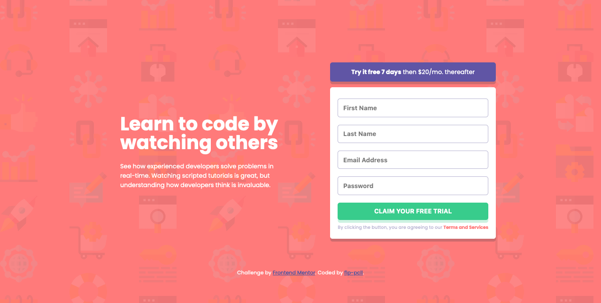

# Frontend Mentor - Intro component with sign up form solution

This is a solution to the [Intro component with sign up form challenge on Frontend Mentor](https://www.frontendmentor.io/challenges/intro-component-with-signup-form-5cf91bd49edda32581d28fd1). Frontend Mentor challenges help you improve your coding skills by building realistic projects. 

## Table of contents

- [Overview](#overview)
  - [The challenge](#the-challenge)
  - [Screenshot](#screenshot)
  - [Links](#links)
  - [Built with](#built-with)
  - [Useful resources](#useful-resources)
- [Author](#author)

## Overview

### The challenge

Users should be able to:

- View the optimal layout for the site depending on their device's screen size
- See hover states for all interactive elements on the page
- Receive an error message when the `form` is submitted if:
  - Any `input` field is empty. The message for this error should say *"[Field Name] cannot be empty"*
  - The email address is not formatted correctly (i.e. a correct email address should have this structure: `name@host.tld`). The message for this error should say *"Looks like this is not an email"*

### Screenshot

### Links

- Solution URL: [Add solution URL here](https://your-solution-url.com)
- Live Site URL: [Add live site URL here](https://your-live-site-url.com)

## My process

### Built with

- Semantic HTML5 markup
- CSS custom properties
- Flexbox
- Vanilla Javascript

### Useful resources

- [Example resource 1](https://www.freecodecamp.org/news/the-100-correct-way-to-do-css-breakpoints-88d6a5ba1862/) - As a beginner, this helped me understand a little more about breakpoints for RWD.
- [Example resource 2](https://css-tricks.com/almanac/properties/b/box-shadow/) - Understanding the box-shadow property. This article has a comparison between box-shadow and filter: drop-shadow().
- [Example resource 3](https://developer.mozilla.org/pt-BR/docs/Web/Accessibility/ARIA/ARIA_Techniques/Using_the_aria-label_attribute) - Using the aria-label attribute.
- [Example resource 4](https://www.w3.org/International/questions/qa-html-language-declarations.pt-br) - Declare language with lang attribute in HTML.
- [Example resource 5](https://www.horadecodar.com.br/2020/09/13/como-validar-email-com-javascript/) - Simple JS Email validation. 

## Author

- Website - [Felipe Pacelli](https://github.com/flp-pcll)
- Frontend Mentor - [@flp-pcll](https://www.frontendmentor.io/profile/flp-pcll)
- Twitter - [@felipe_pacelli](https://twitter.com/felipe_pacelli)

